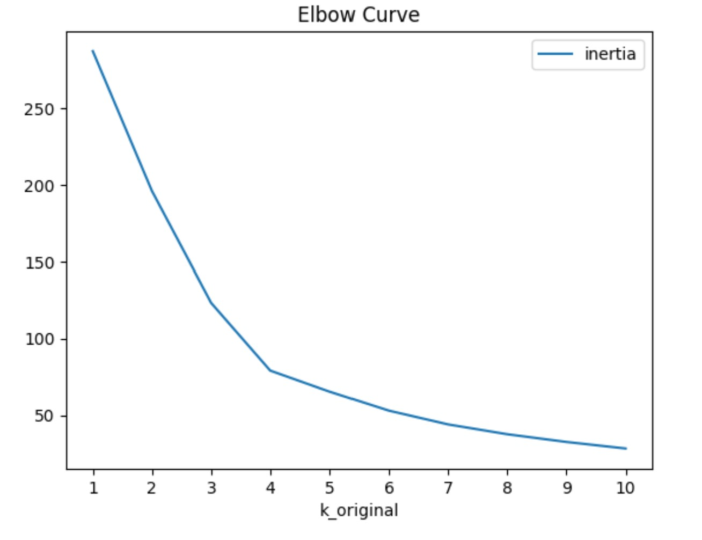
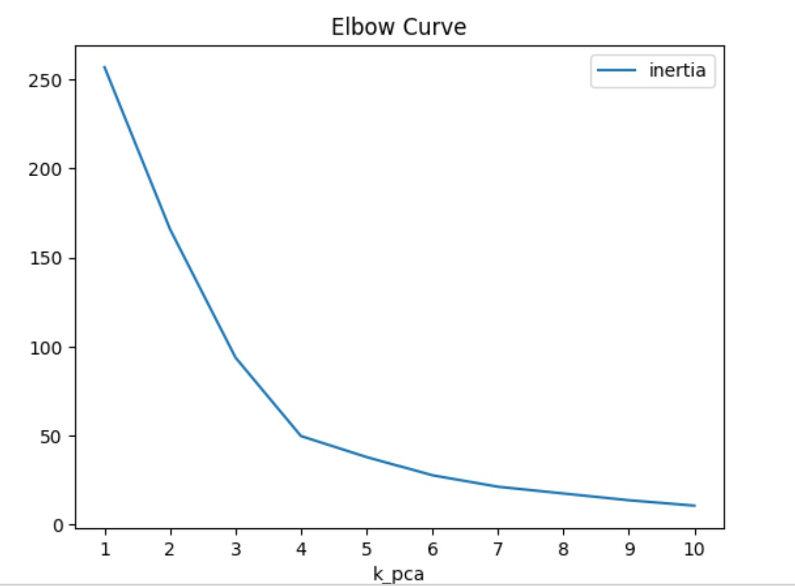
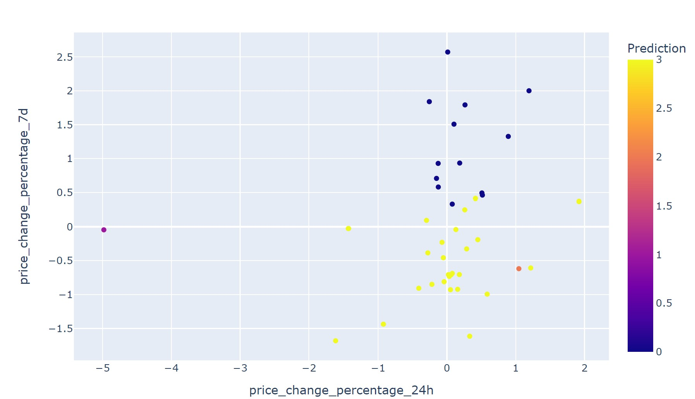

# CryptoClustering
Crypto Clustering Challenge

**Objective:**
To predict if cryptocurrencies are affected by 24-hour or 7-day price changes using unsupervised learning techniques, specifically K-means clustering. Additionally, the project explores the impact of dimensionality reduction using Principal Component Analysis (PCA) on clustering.

**Data used**
crypto_market_data.csv - market data of different cryptocurrencies during different time periods

**Technologies used**
*Google colab
*Python
*Pandas
*Matplotlib
*hvplot
*scikit-learn
*Plotly.express

**Steps followed**
1. Load csv data and preprocess it.
2. Scale the data using StandardScaler.
3. Find the best value for k using the elbow method.
4. Cluster cryptocurrencies with K-means using the original scaled data.
5. Perform PCA to reduce the features to three principal components.
6. Find the best value for k using the PCA data.
7. Cluster cryptocurrencies with K-means using the PCA data.
8. Visualize and compare the results using hvPlot.

**Result**

1. Elbow curve for the original data.

2. Elbow curve for the PCA data.
   

4. Scatter plot of cryptocurrency clusters based on the original data.
   

6. Scatter plot of cryptocurrency clusters based on the PCA data.
   

